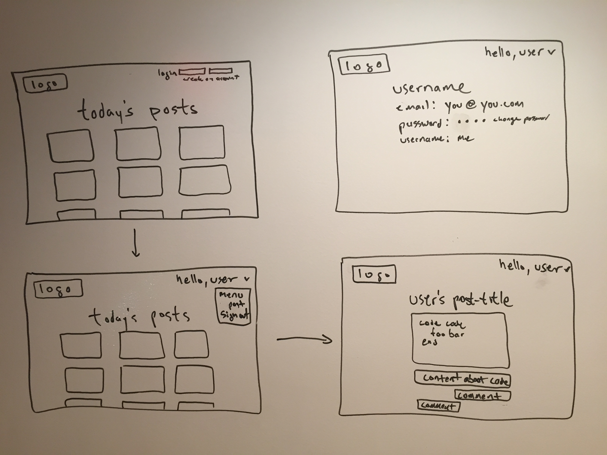
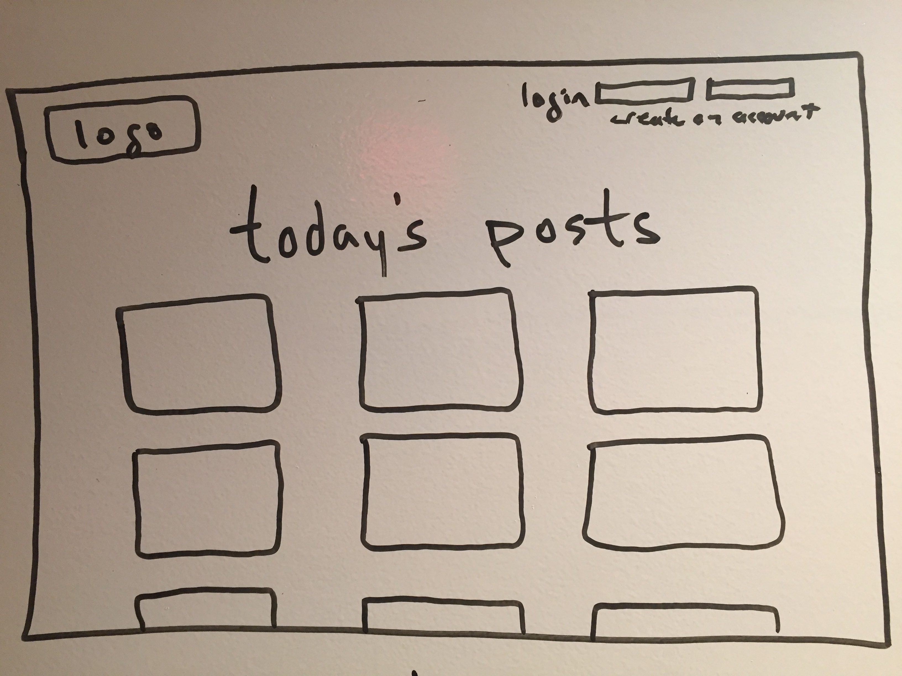
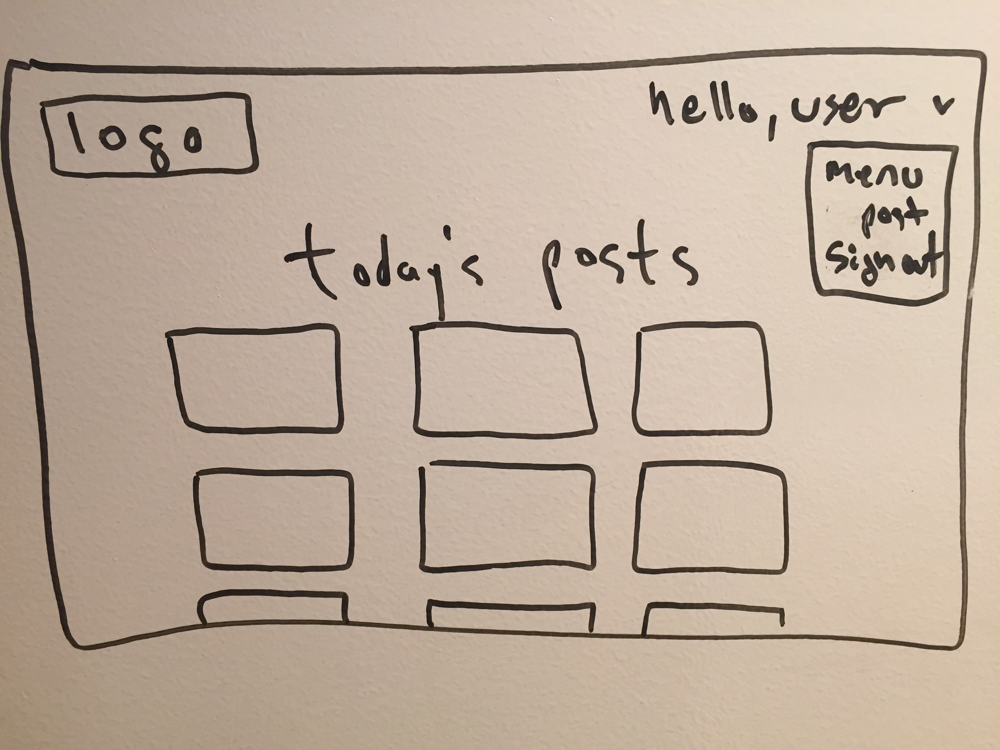
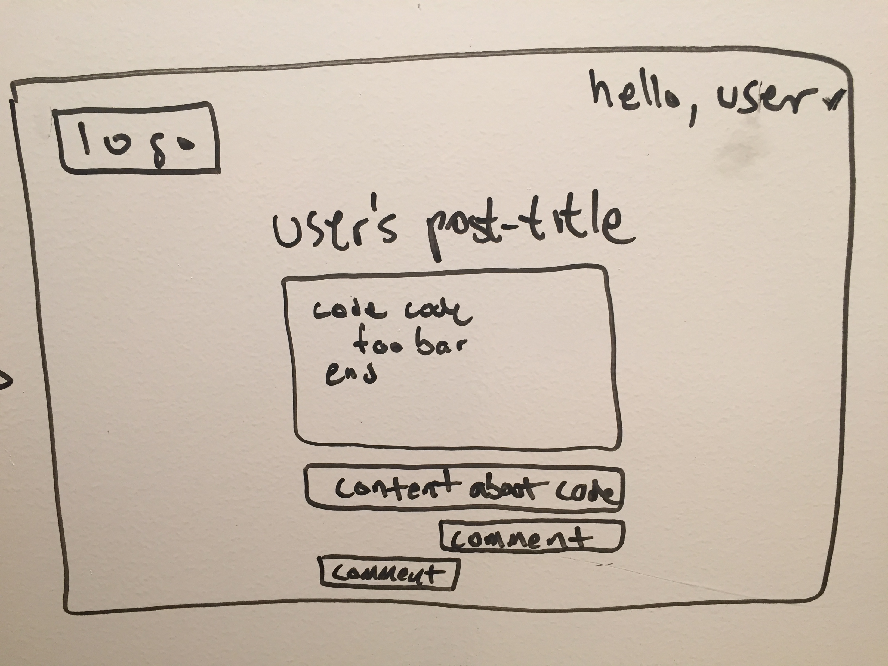
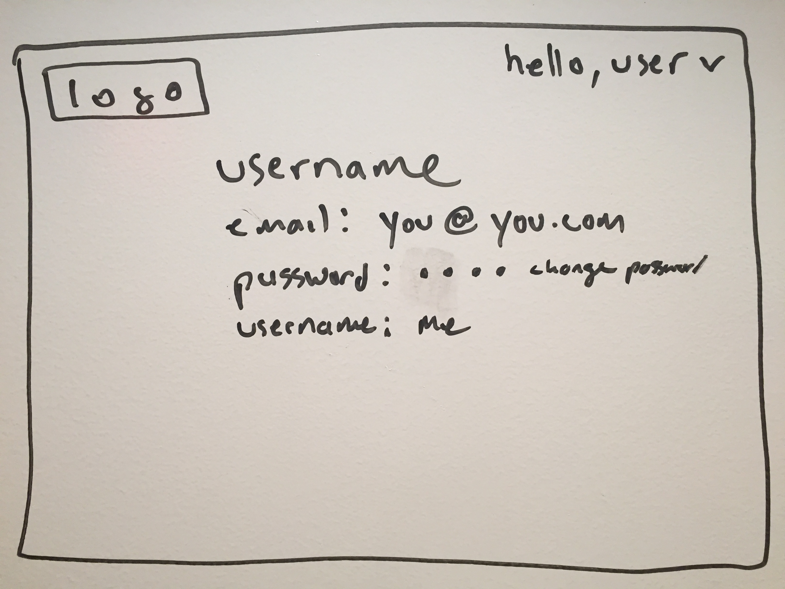
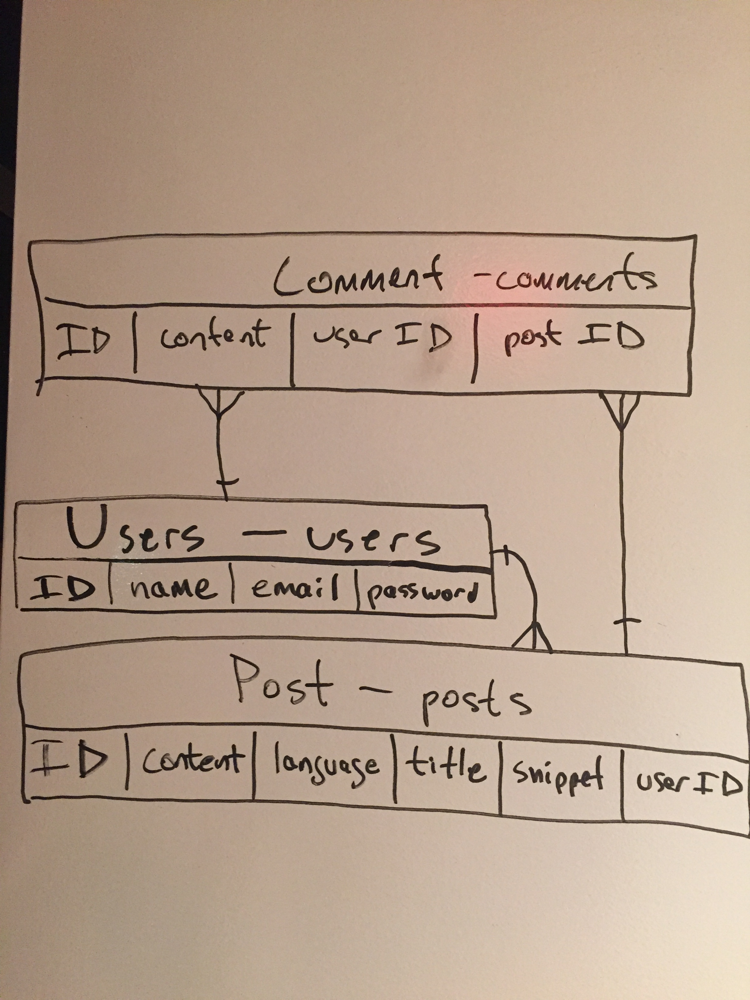

### Minimum Viable Product
This application will serve the purpose of keeping journal entries of your coding projects. The functionality of this application will allow the user to update their post/blog/entry as they are working through their project. The application will render the user's code snippets using the correct syntax highlighting and the user will have the ability to associate a few paragraphs to their code snippet if they choose. Other users will have the ability to comment on any other user's post/blog/entry. All users will have the ability to update or delete any content posted to the website created by their personal login account. This application will have the basic CRUD functionality.

### Approach Taken

The development of this application began with designing a website that closely resembles a blog, but mainly serves as an online diary for developers. Ruby on Rails was used to build CRUD functionality through RESTful architecture. After the application reached its CRUD stage, focus was then aimed at the user interface through the command line.

### Technologies Used

[Ruby on Rails](http://rubyonrails.org)

[ActiveRecord](http://guides.rubyonrails.org/active_record_basics.html)

[CodeRay(for syntax highlighting)](http://coderay.rubychan.de)

### Unsolved Problems

-users can post without providing complete attributes
-users are not prompted when entering invalid information for sign up

### Installation Instructions

1. Create an account at https://dailycode.herokuapp.com
2. Download and install [dailycode.rb](https://github.com/MichaelRCruz/daily_code/blob/master/dailycode.rb) and [credentials.json](https://github.com/MichaelRCruz/daily_code/blob/master/credentials.json) into your project's local directory
3. Within your project's local directory login using the first listed terminal command below and follow the prompts. Follow the syntax of second terminal command below to push a file from your local directory to your dailycode account.

```
ruby dailycode.rb login
```
```
ruby dailycode.rb push "your post title" "your post content" "language used" yourfile.js
```


### Wire Frames







### Entity Relationship Diagram
As displayed below, the rails application will have three models: User, Post, and Comment.


### [Trello](https://trello.com/b/cGb9Ik7P/bloggy-blog)
